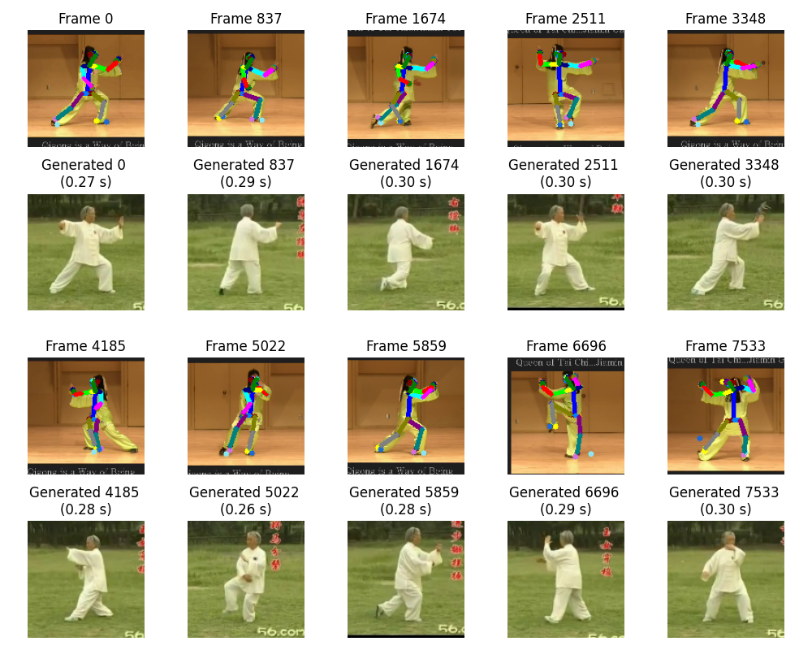
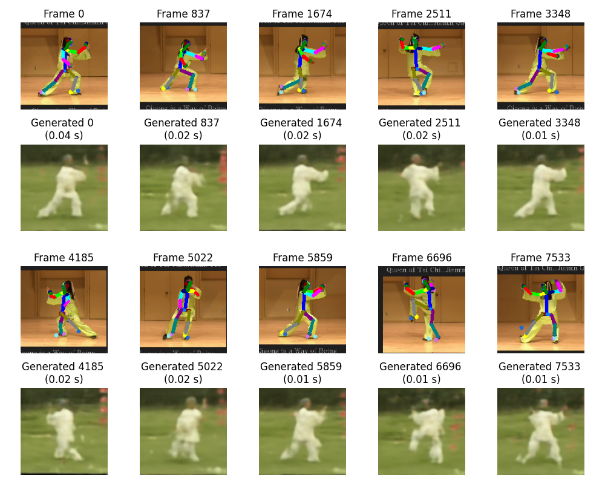
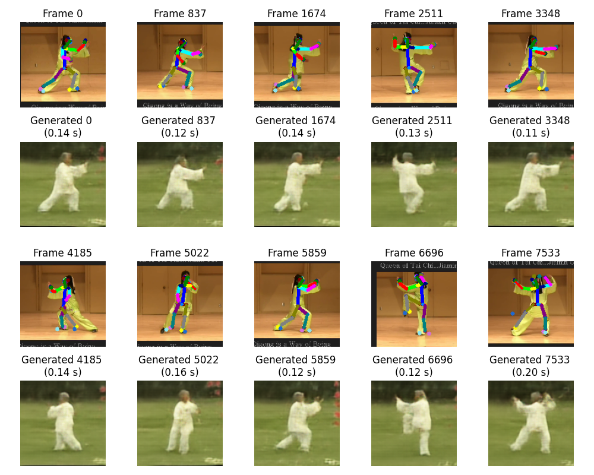
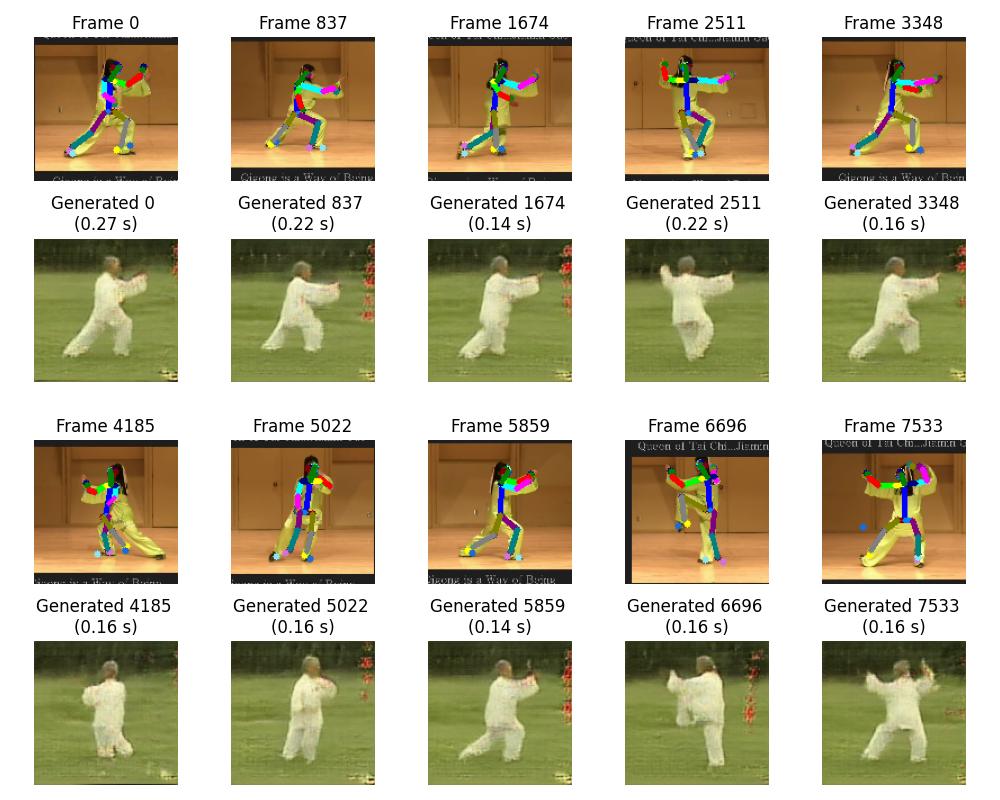

# Group Members
- Axel Colmant
- Mohamed Massamba SENE

# Objectif de ce code
(Ce code est indépendant de tout le reste du dépôt)

À partir d'une vidéo d'une personne source et d'une autre d'une personne, notre objectif est de générer une nouvelle vidéo de la cible effectuant les mêmes mouvements que la source. 

[Allez voir le sujet du TP ici](http://alexandre.meyer.pages.univ-lyon1.fr/m2-apprentissage-profond-image/am/tp_dance/)


# Steps of implementation
To realize this TP we performed the following steps

## Nearest Neighbor
To implement the approach consisting of searching for the closest skeleton, by looking through the Skeleton class we found that there existed a method for calculate the distance between two skeletons as well as in the VideoSkeleton class a method to get all the skeletons.

As such we updated the generate method of the **GenNeirest** class by introducing variables to track the minimal distance found and the index of that closest skeleton. We then loop through all the skeletons in the videoSkeletonTarget by using the *skeCount()* method and calculate the distance between the input skeleton and the current skeleton by using the *distance()* method and update the minimum distance and index if the current distance is smaller the the minimum at that time.

At the end of the loop, if a valid index was found we then return the corresponding image by using the *readImage()* method and if not we return an empty white image.

### Results :


## Direct Network

Seeing as this network presents two approches with one requiring drawing an image form the x,y coordiantes of the given skeleton we first begin by modifying the SkeletonToImageTransform class by modifying the call method in order to create said image by drawing on an empty image using the Skeleton.draw_reduced image and then converting it to a tensor image.<br/>
For the loss function of the model we want to use a combination of perceptual, reconstruction and pose losses while assigning weights to each. The reconstruction and pose loss allow us to check that the generated image pose is indeed correct and the perceptual loss allows us to have good visuals. We also create two networks<br/>
- **GenNNSkeToImage**
This network allows us to create a new image from the given skeleton posture in x,y coordinates which are flattened into a 1D tensor. We thus create the neural network by upsampling to project the input to a higher dimension then uspsampling into an inital 16x16 images we also apply self-attention before going through a residual block as presented in the ResNet architecture and apply our final upsampling to get the image size of (3,128,128). We also use the Tanh activation function to normalize the image between -1 et 1 and initialize the weights using the *init_weights()* method.
We also write the *forward()* method to pass the inputs to the model
- **GenNNSkeImToImage**
This network allows us to create a new image from the given skeleton posture in x,y coordinates which was turned into an image beforehand. To do so we proceed by first downsampling the image into a smaller representation then going through the bottleneck with residual blocks before upsampling the obtained representation to the final image. To ensure better consistent and better feature representation we also include skip connections as shown in the UNet architecture between corresponding encoder and decoder blocks. We also use the Tanh activation function to normalize the image between -1 et 1 and initialize the weights using the *init_weights()* method. We write the *forward()* method to pass our inputs to the model

We then update the **GenVanillaNN** class's intialization method by setting the source transformation and network to use based on the selected option. For option 1 we have no source transformation and we use the GenSkeToImage network, for option 2 we use the SkeToImageTransform as source transformation on the input ske to obtain the image and the GenImageToImage network. We also update the filename to include the option selected and the target video name in order to not overwrite the saved models for differents options or videos. We leave the rest of the code as it was with the creation of the dataset now also including the source transformation.<br/>
We then write the *train()* method which starts by the initialisation of the loss (L1Loss which allows us to compute the MAE between the generated and output images), optimizer (Adam) and passing the model to training mode. The training loop then consists of looping through the epochs and for each epoch we retrieve the batches in the dataloader.<br/> Thus for each batch, we perform the training by predicting images based on the skeleton by forward passing the inputs to the model we then retrieve the generated poses from the predicted images then compute the combined loss before backpropagating the loss and updating the weights. At the end of each epoch we print the loss. After going through all batches we start the next epoch, and after all epochs of training we then save the obtained network.

We also write the *generate()* method which starts by setting the model to evaluation mode and disabling gradient calculation, we then preprocess the input skeleton and adding to it a dimension for the batch. We then pass the image to our model for prediction before converting the obtained tensor to an image using the *tensor2image()* method of the dataset.

We also update the main function of the file so that when run it now trains for both option 1 and option 2 for 50 epochs each.

### Results :
#### Skeleton to Image


#### Skeleton Image to Image


## GAN

We first start creating our discriminator network to predict whether the images are real or fake. The network consists of first downsampling the input image using convolution to obtain feature maps before using a *Sigmoid* activation function in order to get a value between 0 and 1 based on whether the image is real or not.<br/>
We also use as loss function the Binary Cross Entropy as we are performing binary classification for the Discriminator and it is well suited to the task and for the Generator we use a combination of our previous L1Loss as well as the adversarial loss which is also binary cross entropy based on whether the generator was able to fool the discriminator or not.

We then update the **GenGAN** class by first updating the initialisation method in order to use an instance of GenImageToImage class as generator and an instance of Discriminator class as the discriminator. We also add as source transformation the SkeToImageTransform with input_size 128 to our dataset as we will use images from the skeleton and we leave the reset as is.<br/>
We then write the *train()* method which starts by the initialisation of the losses (BCE and L1Loss), the optimizers for the generator and discriminator as well as passing both networks to training mode. The training loop then consists of looping through the epochs and for each epoch we retrieve the batches in the dataloader.<br/> Thus for each batch, we generate image from the input by forwarding them through the generator and also create tensors for the labels fake and real. We also the retrieve the generated poses from the images.<br/>
We then start by training the discriminator, to do so we forward pass it the target images and compute its loss on them and we then forward pass it the generated images and compute its loss on them. We then combine the two losses to get the total loss before backpropagating and updating the weights. Next we train the generator by computing its combined loss before backpropagating and updating the weights. After going through all batches we start the next epoch, and after all epochs of training we then save the obtained generator.

We also write the *generate()* method which starts by setting the generator to evaluation mode and disabling gradient calculation, we then preprocess the input skeleton and adding to it a dimension for the batch. We then pass the image to our generator for prediction before converting the obtained tensor to an image using the *tensor2image()* method of the dataset.

We also update the main function of the file to perform training for 10 epochs.

### Results :



# Running the code
## Create and activate an environment with all the required dependenc
```bash
conda env create -f env.yaml
conda activate tp_image 
```
Then create the training data
```bash
python VideoSkeleton.py
```

## Training 
To train the networks separately it can be done through the following steps
- Training the GenVanillaNN
```bash
python GenVanillaNN.py
```
This will train both the SkeToImage model and the ImageToImage model for 50 epochs
- Training the GAN
```bash
python GenGAN.py
```
This will train the GAN for 10 epochs

## Running the code
Run the DanceDemo.py file while modifying the GEN_TYPE variable to modify the network used to the generation (1 for nearest, 2 for direct network with coordinates, 3 for direct network with skeleton image, 4 for GAN) as well as the source and target video filenames. The network will then be trained if no weights file are already present or loaded if so. Once the model is trained/loaded the demo will run afterwards.
```bash
conda activate tp_image 
python DanceDemo.py
```